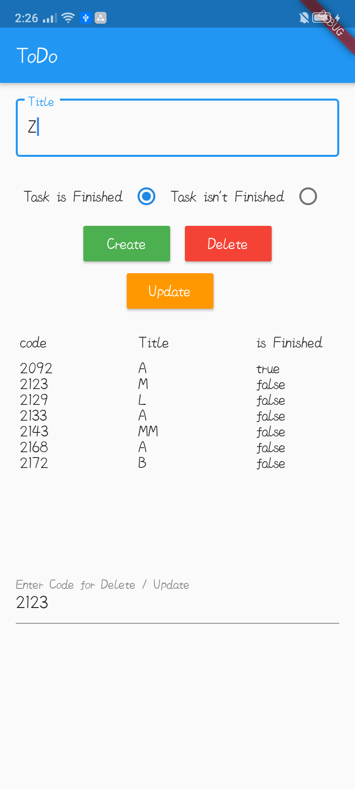
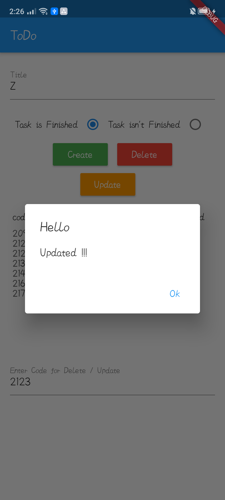
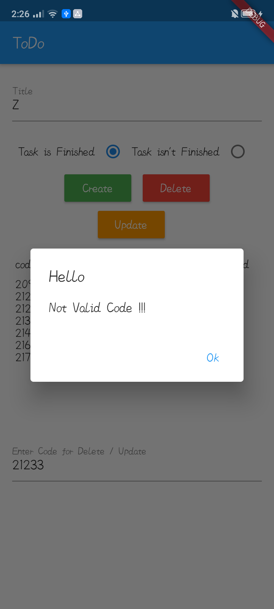

# CRUD operations using Flutter and Firebase


## Installation

get all dependencies

```bash
pub get
```

## Demo

### APK Link
https://drive.google.com/file/d/1icXEBq_SDnCFJoMa_m080F2mlew_NC8Y/view?usp=sharing


### Screenshots




